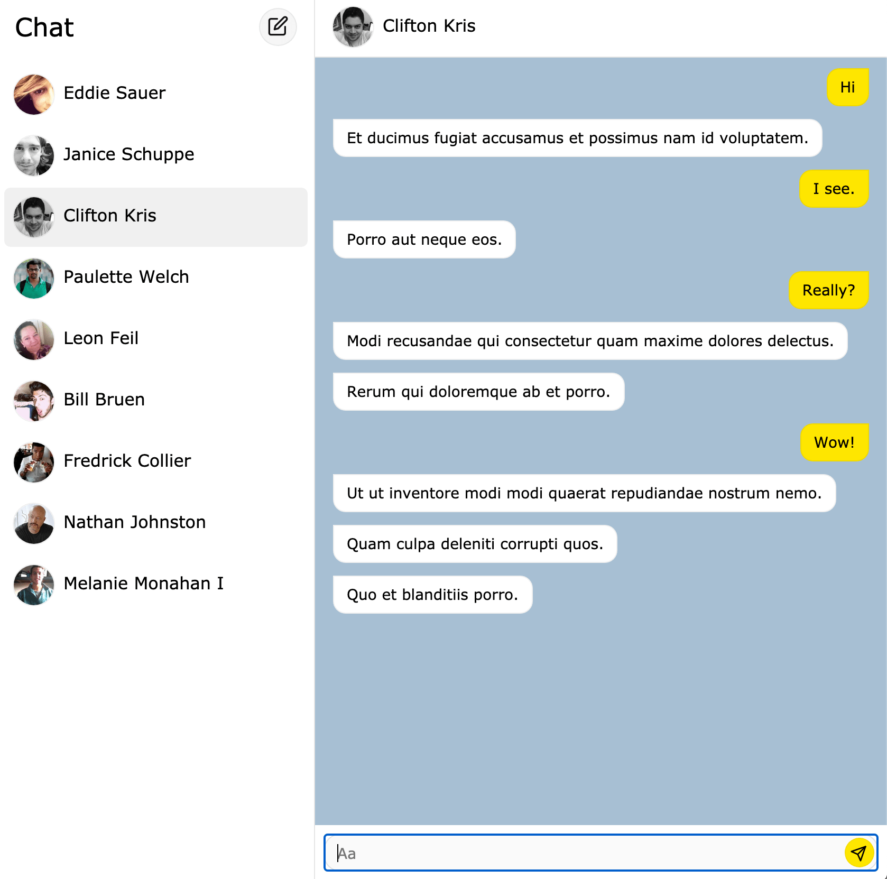

# Messenger

Demo: <https://uxplus.dev/messenger/>



## Install dependencies

```
npm install
```

## Run web server for development
```
npm start
```

## Build static files for production
```
npm run build
```

## Lint and fix files
```
npm lint
```

## Run tests
```
npm test
```
